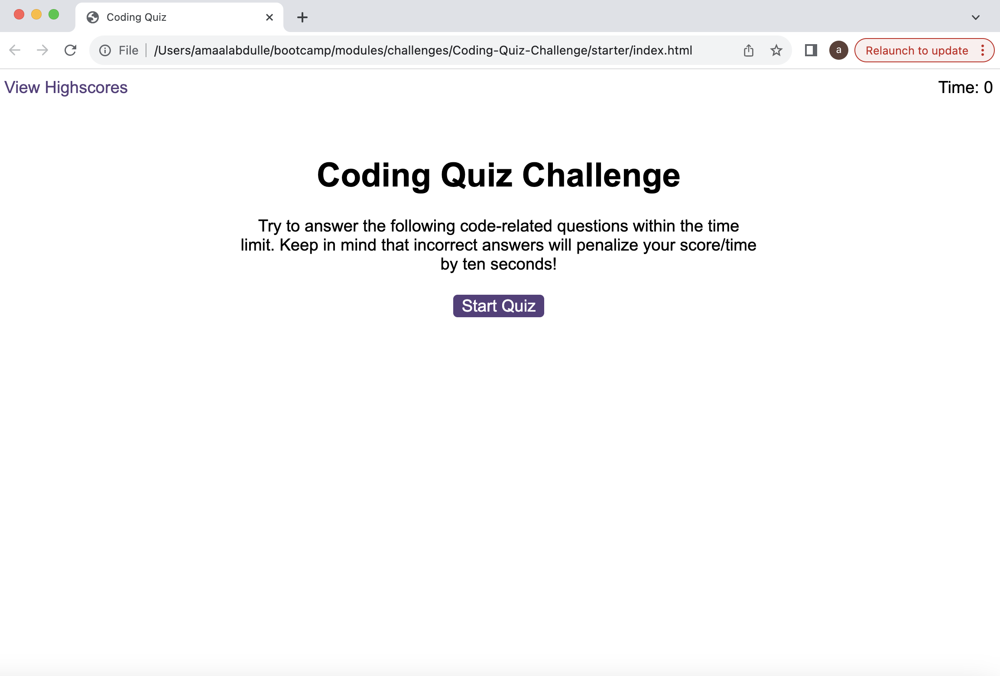
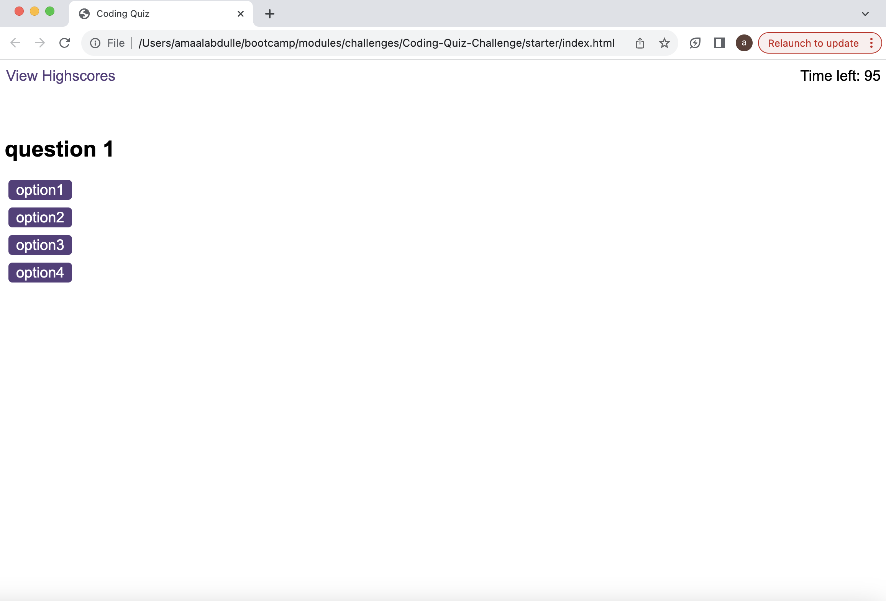

# Coding-Quiz-Challenge
Making a coding quiz using javascript!

## Description

In this weeks challenege, I created coding quiz using mainly javascript. The idea was to get the quiz and the timer to start once the button is pressed and any wrong answer will have a negative effect on the time left. Finally, the the time left over will be the users score.

Only completed a 1/3 of this project and I plan to continue it. So far, the button works where it starts the timer and the questions are displayed, as well as hiding the start screen. Next, I plan to input some questions and figure out a way to calculate the score.

## Installation

No steps required to install project.

## Usage

To start the quiz, user will need to press the 'start quiz' button where they will see the first question displayed and the timer will start to count down.

Link to deployed website: https://amaalabdulle.github.io/Coding-Quiz-Challenge/

## Credits

Collaborated with the EdX Web Development team. All html & css was suplied by them. All of the JavaScript code was done by myself.

## License

N/A
